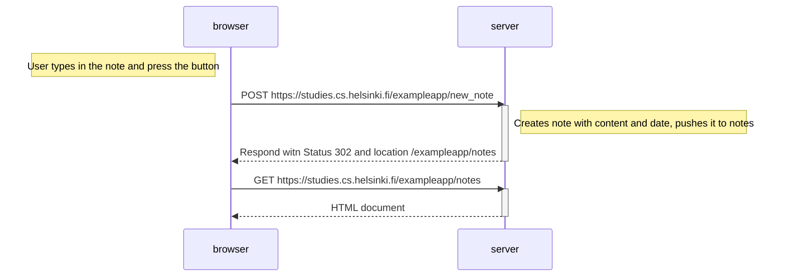

```mermaid
sequenceDiagram
  participant browser
  participant server

  Note left of browser: User types in the note and press the button

  browser->>server: POST https://studies.cs.helsinki.fi/exampleapp/new_note
  activate server
  Note right of server: Creates note with content and date, pushes it to notes
  server-->>browser: Respond witn Status 302 and location /exampleapp/notes
  deactivate server

  browser->>server: GET https://studies.cs.helsinki.fi/exampleapp/notes
  activate server
  server-->>browser: HTML document
  deactivate server
```

