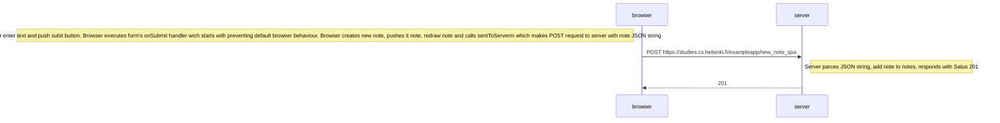

```mermaid
sequenceDiagram
  participant browser
  participant server

  Note left of browser: User enter text and push subit button. Browser executes form's onSubmit handler wich starts     with preventing default browser behaviour. Browser creates new note, pushes it note, redraw note and calls  sentToServerm which makes POST request to server with note JSON string

  browser->>server: POST https://studies.cs.helsinki.fi/exampleapp/new_note_spa
  Note right of server: Server parces JSON string, add note to notes, responds with Satus 201
  server-->>browser: 201
```
